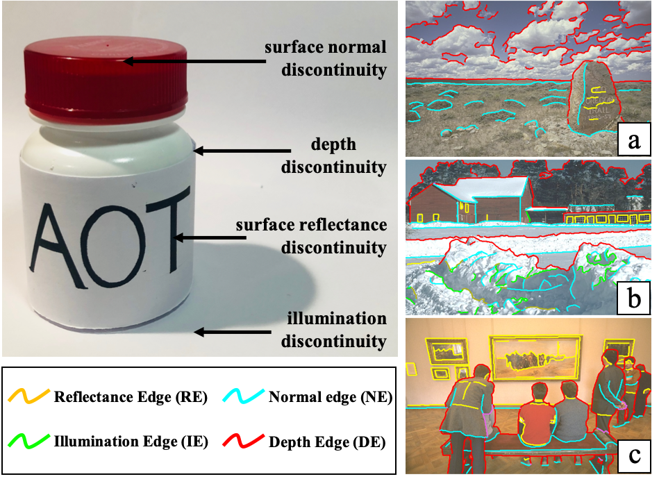
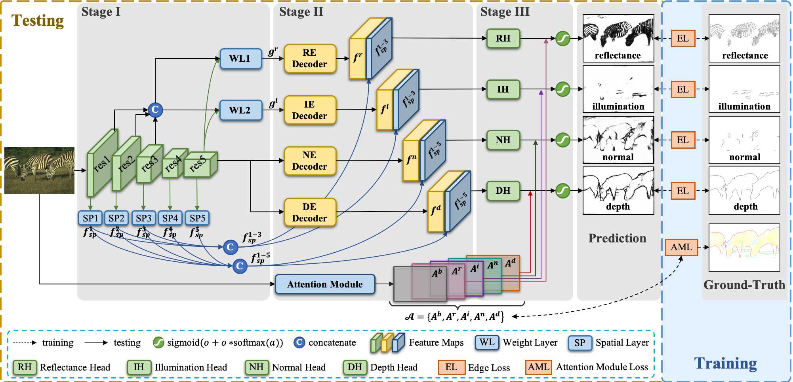

# RINDNet
> [RINDNet: Edge Detection for Discontinuity in Reflectance, Illumination, Normal and Depth](https://arxiv.org/abs/2108.00616)                 
> Mengyang Pu, Yaping Huang, Qingji Guan and Haibin Ling                 
> *ICCV 2021* (oral)

Please refer to [supplementary material](https://pan.baidu.com/s/1oMteiIaPwjWgH-ihCA2S5g) (code:p86d) (~60M) for more results.

## Benchmark --- 🔥🔥BSDS-RIND🔥🔥
BSDS-RIND is the first public benchmark that dedicated to studying simultaneously the four edge types, namely Reflectance Edge (RE), Illumination Edge (IE), Normal Edge (NE) and Depth Edge (DE). It is created by carefully labeling images from the [BSDS500](https://www2.eecs.berkeley.edu/Research/Projects/CS/vision/grouping/resources.html).
The datasets can be downloaded from:
- Original images: [BSDS500](https://www2.eecs.berkeley.edu/Research/Projects/CS/vision/grouping/resources.html)
- Our annotations: BSDS-RIND ([BaiDuNetdisk](https://pan.baidu.com/s/1UPIIqhZtQte4RO5WwcjqFg), code:e7rg ; [GoogleDrive](https://drive.google.com/drive/folders/1W4bF2pMEa5g2Wc0qskr-GiotNx0XAbeX?usp=sharing))




## Abstract
As a fundamental building block in computer vision, edges can be categorised into four types according to the discontinuity in *surface-Reflectance*, *Illumination*, *surface-Normal* or *Depth*. While great progress has been made in detecting generic or individual types of edges, it remains under-explored to comprehensively study all four edge types together. In this paper, we propose a novel neural network solution, *RINDNet*, to jointly detect all four types of edges. Taking into consideration the distinct attributes of each type of edges and the relationship between them, RINDNet learns effective representations for each of them and works in three stages. In stage I, RINDNet uses a common backbone to extract features shared by all edges. Then in stage II it branches to prepare discriminative features for each edge type by the corresponding decoder. In stage III, an independent decision head for each type aggregates the features from previous stages to predict the initial results. Additionally, an attention module learns attention maps for all types to capture the underlying relations between them, and these maps are combined with initial results to generate the final edge detection results. For training and evaluation, we construct the first public benchmark, BSDS-RIND, with all four types of edges carefully annotated. In our experiments, RINDNet yields promising results in comparison with state-of-the-art methods.



## Usage
### Training
1. Clone this repository to local
```shell
git clone https://github.com/MengyangPu/RINDNet.git
```
2. Download the [augmented data](https://drive.google.com/file/d/1CO5QZvuzD9AoQ-t9pFsRJSL7ldAkOSqc/view?usp=sharing) to the local folder /data

3. run train
```shell
python train_rindnet.py
or
python train_rindnet_edge.py
```
more train files (train_*modelname*.py and train_*modelname_edge*.py) in [/train_tools](train_tools)

4. Note: The imagenet pretrained vgg16 pytorch model for BDCN can be downloaded in [vgg16.pth](link: https://pan.baidu.com/s/10Tgjs7FiAYWjVyVgvEM0mA) code: ab4g.
         The imagenet pretrained vgg16 pytorch model for HED can be downloaded in [5stage-vgg.py36pickle](https://pan.baidu.com/s/1lQbAnNhymhXPYM2wL0cSnA) code: 9po1.

### Testing
1. Download Pre-trained model for **four types of edges**, including Reflectance Edges (REs), Illumination Edges (IEs), Normal Edges (NEs), and Depth Edges (DEs).

|   Method   | model                                   | Pre-trained Model  [GoogleDrive](https://drive.google.com/drive/folders/1pAgUXxJczZ4wG3M56eeuiYAjuSXTpqNf?usp=sharing)                                                          |
| ---------- | --------------------------------------- | ------------------------------------------------------------------------ | 
| HED        |[modeling/hed](modeling/hed.py)          | [run/hed](https://pan.baidu.com/s/1DykNF-tXFUWMpEXUJHv-4w), code:ef18    |
| CED        |[code](https://github.com/Wangyupei/CED) | [download]()                                                             |
| RCF        |[modeling/rcf](modeling/rcf.py)          | [run/rcf](https://pan.baidu.com/s/1DykNF-tXFUWMpEXUJHv-4w), code:ef18    |
| BDCN       |[modeling/bdcn](modeling/bdcn.py)        | [run/bdcn](https://pan.baidu.com/s/1DykNF-tXFUWMpEXUJHv-4w), code:ef18   |
| DexiNed    |[modeling/dexined](modeling/dexined.py)  | [run/dexined](https://pan.baidu.com/s/1DykNF-tXFUWMpEXUJHv-4w), code:ef18|
| CASENet    |[modeling/casenet](modeling/casenet.py)  | [run/casenet](https://pan.baidu.com/s/1DykNF-tXFUWMpEXUJHv-4w), code:ef18|
| DFF        |[modeling/dff](modeling/dff.py)          | [run/dff](https://pan.baidu.com/s/1DykNF-tXFUWMpEXUJHv-4w), code:ef18    |
|\*DeepLabv3+|[modeling/deeplab](modeling/deeplab.py)  | [run/deeplab](https://pan.baidu.com/s/1DykNF-tXFUWMpEXUJHv-4w), code:ef18|
|\*DOOBNet   |[modeling/doobnet](modeling/doobnet.py)  | [run/doobnet](https://pan.baidu.com/s/1DykNF-tXFUWMpEXUJHv-4w), code:ef18|
|\*OFNet     |[modeling/ofnet](modeling/ofnet.py)      | [run/ofnet](https://pan.baidu.com/s/1DykNF-tXFUWMpEXUJHv-4w), code:ef18  |
| DeepLabv3+ |[modeling/deeplab2](modeling/deeplab2.py)| [run/deeplab2](https://pan.baidu.com/s/1DykNF-tXFUWMpEXUJHv-4w), code:ef18|
| DOOBNet    |[modeling/doobnet2](modeling/doobnet2.py)| [run/doobnet2](https://pan.baidu.com/s/1DykNF-tXFUWMpEXUJHv-4w), code:ef18|
| OFNet      |[modeling/ofnet2](modeling/ofnet2.py)    | [run/ofnet2](https://pan.baidu.com/s/1DykNF-tXFUWMpEXUJHv-4w), code:ef18 |
| RINDNet    |[modeling/rindnet](modeling/rindnet.py)  | [run/rindnet](https://pan.baidu.com/s/1DykNF-tXFUWMpEXUJHv-4w), code:ef18|

Download Pre-trained model for **Generic Edges**.

|   Method   | model                                            | Pre-trained Model                                                              |
| ---------- | ------------------------------------------------ | ------------------------------------------------------------------------------ | 
| HED        |[modeling/hed_edge](modeling/hed_edge.py)         | [run_edge/hed](https://pan.baidu.com/s/1dIScqwNA-79PYW-fGeMYLg), code:jhsr     |
| CED        |[code](https://github.com/Wangyupei/CED)          | [download]()                                                                   |
| RCF        |[modeling/rcf_edge](modeling/rcf_edge.py)         | [run_edge/rcf](https://pan.baidu.com/s/1dIScqwNA-79PYW-fGeMYLg), code:jhsr     |
| BDCN       |[modeling/bdcn_edge](modeling/bdcn_edge.py)       | [run_edge/bdcn](https://pan.baidu.com/s/1dIScqwNA-79PYW-fGeMYLg), code:jhsr    |
| DexiNed    |[modeling/dexined_edge](modeling/dexined_edge.py) | [run_edge/dexined](https://pan.baidu.com/s/1dIScqwNA-79PYW-fGeMYLg), code:jhsr |
| CASENet    |[modeling/casenet_edge](modeling/casenet_edge.py) | [run_edge/casenet](https://pan.baidu.com/s/1dIScqwNA-79PYW-fGeMYLg), code:jhsr |
| DFF        |[modeling/dff_edge](modeling/dff_edge.py)         | [run_edge/dff](https://pan.baidu.com/s/1dIScqwNA-79PYW-fGeMYLg), code:jhsr     |
| DeepLabv3+ |[modeling/deeplab_edge](modeling/deeplab_edge.py) | [run_edge/deeplab](https://pan.baidu.com/s/1dIScqwNA-79PYW-fGeMYLg), code:jhsr |
| DOOBNet    |[modeling/doobnet_edge](modeling/doobnet_edge.py) | [run_edge/doobnet](https://pan.baidu.com/s/1dIScqwNA-79PYW-fGeMYLg), code:jhsr |
| OFNet      |[modeling/ofnet_edge](modeling/ofnet_edge.py)     | [run_edge/ofnet](https://pan.baidu.com/s/1dIScqwNA-79PYW-fGeMYLg), code:jhsr   |
| RINDNet    |[modeling/rindnet_edge](modeling/rindnet_edge.py) | [run_edge/rindnet](https://pan.baidu.com/s/1dIScqwNA-79PYW-fGeMYLg), code:jhsr |

2. Setting the path in [evaluate.py](evaluate.py) or [evaluate_edge.py](evaluate_edge.py).
3. run
```shell
python evaluate.py
or
python evaluate_edge.py
```
### Eval
The .mat format files of testing set can be download [here](https://drive.google.com/file/d/1pLXJblrHMxy3p2c6ulSUSAG5AoV_KaC9/view?usp=sharing).
```shell
cd eval
run eval.m
```

## Main results

### BSDS-RIND

|   Method   | model                       | Reflectance F\-measure | Illumination F\-measure | Normal F\-measure |Depth F\-measure | Average F\-measure |
| ---------- | --------------------------- | ------------------ | ------------------ | ------------------ | ------------------ | ------------------ |

|   Method   | model                       | ODS  | OIS  | AP   | ODS  | OIS  | AP   | ODS  | OIS  | AP   | ODS  | OIS  | AP   | ODS  | OIS  | AP   |
| ---------- | --------------------------- | ---- | ---- | ---- | ---- | ---- | ---- | ---- | ---- | ---- | ---- | ---- | ---- | ---- | ---- | ---- |
| HED        |[model](modeling/hed.py)     | 0.412| 0.466| 0.343| 0.256| 0.290| 0.167| 0.457| 0.505| 0.395| 0.644| 0.679| 0.667| 0.442| 0.485| 0.393|
| CED        |-                            | 0.429| 0.473| 0.361| 0.228| 0.286| 0.118| 0.463| 0.501| 0.372| 0.626| 0.655| 0.620| 0.437| 0.479| 0.368|
| RCF        |[model](modeling/rcf.py)     | 0.429| 0.448| 0.351| 0.257| 0.283| 0.173| 0.444| 0.503| 0.362| 0.648| 0.679| 0.659| 0.445| 0.478| 0.386|
| BDCN       |[model](modeling/bdcn.py)    | 0.358| 0.458| 0.252| 0.151| 0.219| 0.078| 0.427| 0.484| 0.334| 0.628| 0.661| 0.581| 0.391| 0.456| 0.311|
| DexiNed    |[model](modeling/dexined.py) | 0.402| 0.454| 0.315| 0.157| 0.199| 0.082| 0.444| 0.486| 0.364| 0.637| 0.673| 0.645| 0.410| 0.453| 0.352|
| CASENet    |[model](modeling/casenet.py) | 0.384| 0.439| 0.275| 0.230| 0.273| 0.119| 0.434| 0.477| 0.327| 0.621| 0.651| 0.574| 0.417| 0.460| 0.324|
| DFF        |[model](modeling/dff.py)     | 0.447| 0.495| 0.324| 0.290| 0.337| 0.151| 0.479| 0.512| 0.352| 0.674| 0.699| 0.626| 0.473| 0.511| 0.363|
|\*DeepLabv3+|[model](modeling/deeplab.py) | 0.297| 0.338| 0.165| 0.103| 0.150| 0.049| 0.366| 0.398| 0.232| 0.535| 0.579| 0.449| 0.325| 0.366| 0.224|
|\*DOOBNet   |[model](modeling/doobnet.py) | 0.431| 0.489| 0.370| 0.143| 0.210| 0.069| 0.442| 0.490| 0.339| 0.658| 0.689| 0.662| 0.419| 0.470| 0.360|
|\*OFNet     |[model](modeling/ofnet.py)   | 0.446| 0.483| 0.375| 0.147| 0.207| 0.071| 0.439| 0.478| 0.325| 0.656| 0.683| 0.668| 0.422| 0.463| 0.360|
| DeepLabv3+ |[model](modeling/deeplab2.py)| 0.444| 0.487| 0.356| 0.241| 0.291| 0.148| 0.456| 0.495| 0.368| 0.644| 0.671| 0.617| 0.446| 0.486| 0.372|
| DOOBNet    |[model](modeling/doobnet2.py)| 0.446| 0.503| 0.355| 0.228| 0.272| 0.132| 0.465| 0.499| 0.373| 0.661| 0.691| 0.643| 0.450| 0.491| 0.376|
| OFNet      |[model](modeling/ofnet2.py)  | 0.437| 0.483| 0.351| 0.247| 0.277| 0.150| 0.468| 0.498| 0.382| 0.661| 0.687| 0.637| 0.453| 0.486| 0.380|
| RINDNet    |[model](modeling/rindnet.py) | 0.478| 0.521| 0.414| 0.280| 0.337| 0.168| 0.489| 0.522| 0.440| 0.697| 0.724| 0.705| 0.486| 0.526| 0.432|

### Plot edge PR curves of RIND
We have released the code and data for plotting the edge PR curves of the above edge detectors [here](https://github.com/MengyangPu/RINDNet/tree/main/plot-rind-edge-pr-curves).

### Precomputed Results
If you want to compare your method with RINDNet and other methods, you can download the precomputed results [here](https://pan.baidu.com/s/1SEQdbibqnntb_fJqiw2VVw) (code: ewco).

## Acknowledgments
- The work is partially done while Mengyang was at Stony Brook University.
- We thank the anonymous reviewers for valuable and inspiring comments and suggestions.
- Thanks to previous open-sourced repo:<br/>
  [HED-pytorch](https://github.com/xwjabc/hed)<br/>
  [RCF-pytorch](https://github.com/meteorshowers/RCF-pytorch)<br/>
  [BDCN](https://github.com/pkuCactus/BDCN)<br/>
  [DexiNed](https://github.com/xavysp/DexiNed)<br/>
  [DFF](https://github.com/Lavender105/DFF)<br/>
  [pytorch-deeplab-xception](https://github.com/jfzhang95/pytorch-deeplab-xception)<br/>
  [DOOBNet-pytorch](https://github.com/yuzhegao/doob)
  
## Reference
```bibtex
@InProceedings{Pu_2021ICCV_RINDNet,
    author    = {Pu, Mengyang and Huang, Yaping and Guan, Qingji and Ling, Haibin},
    title     = {RINDNet: Edge Detection for Discontinuity in Reflectance, Illumination, Normal and Depth},
    booktitle = {Proceedings of the IEEE/CVF International Conference on Computer Vision (ICCV)},
    month     = {October},
    year      = {2021},
    pages     = {6879-6888}
}
```
