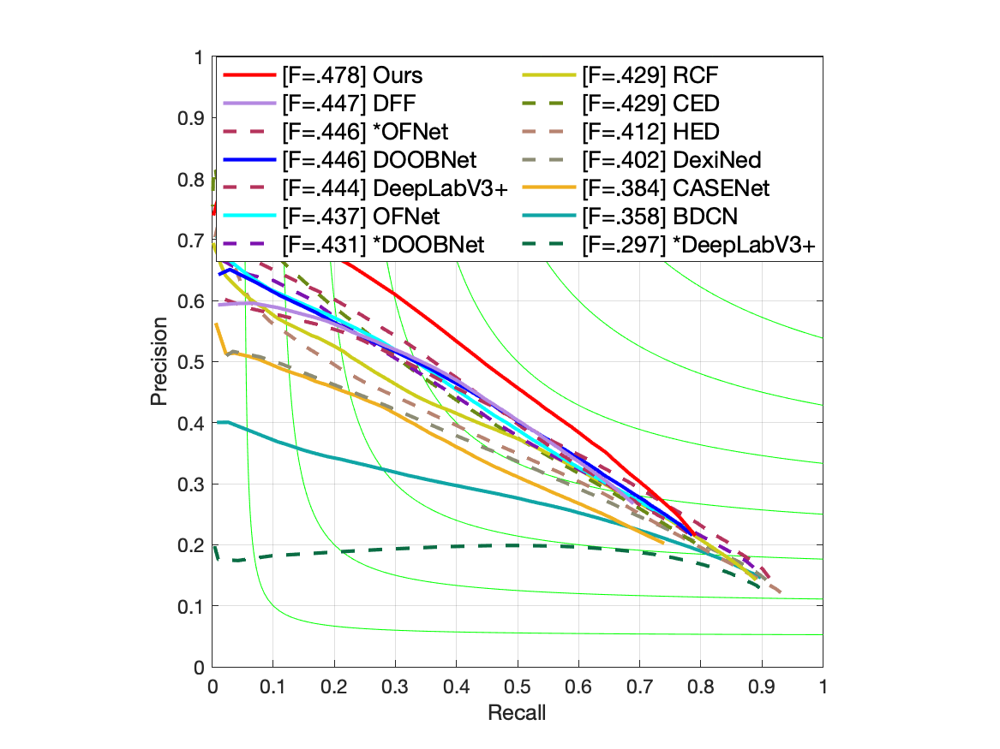
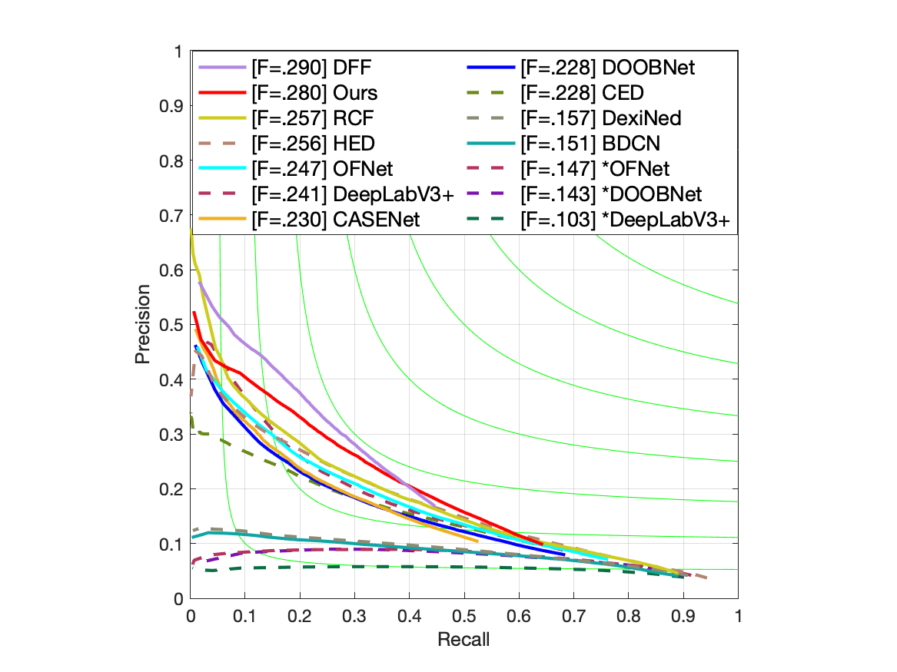
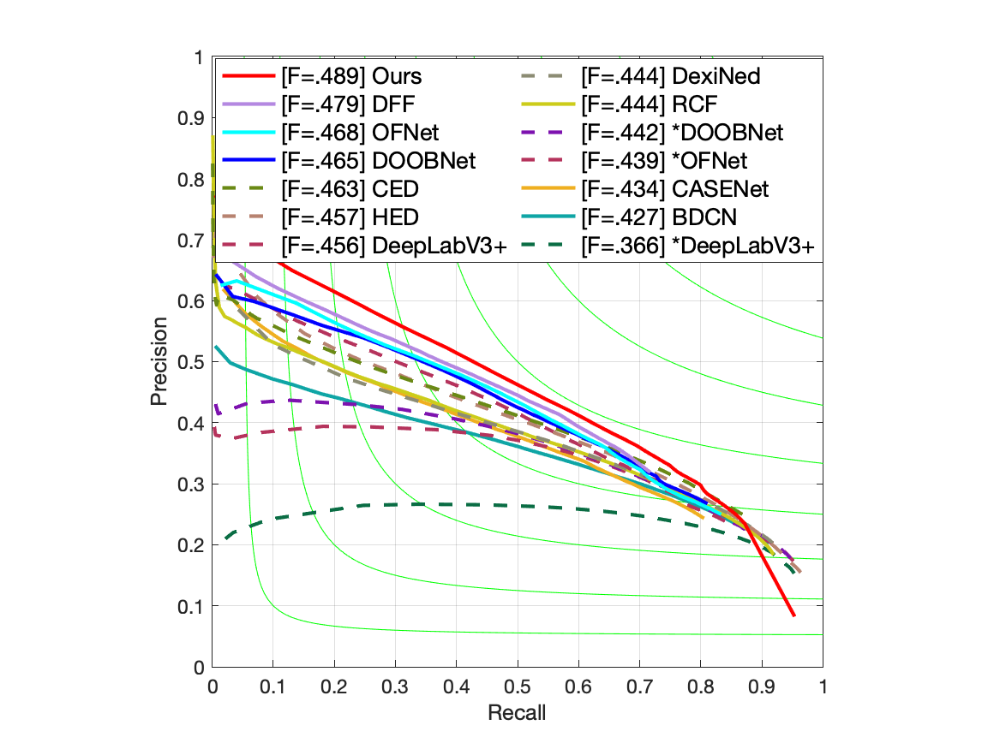
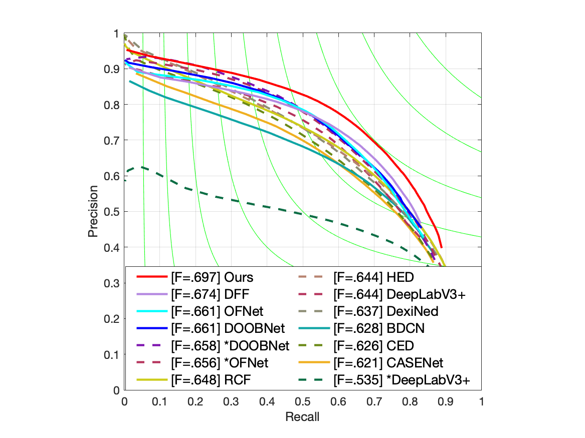
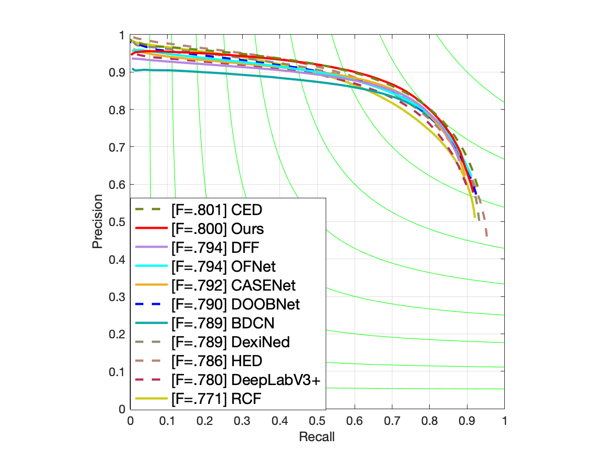

## Plot rind-edge PR Curves

```shell
run plot_rind_edge.m
run plot_rind_alledges.m
```

### Reflectance Edges PR Curves


### Illumination Edges PR Curves


### Normal Edges PR Curves


### Depth Edges PR Curves


### All Edges PR Curves



## Reference

1. HED
```bibtex
@inproceedings{xie2015hed,
  title={Holistically-nested edge detection},
  author={Xie, Saining and Tu, Zhuowen},
  booktitle=ICCV,
  pages={1395--1403},
  year={2015}
}
```

2. CED
```bibtex
@inproceedings{wang2017ced,
  title={Deep crisp boundaries},
  author={Wang, Yupei and Zhao, Xin and Huang, Kaiqi},
  booktitle=CVPR,
  pages={3892--3900},
  year={2017}
}
```

3. RCF
```bibtex
@inproceedings{liu2017rcf,
  title={Richer convolutional features for edge detection},
  author={Liu, Yun and Cheng, Ming-Ming and Hu, Xiaowei and Wang, Kai and Bai, Xiang},
  booktitle=CVPR,
  pages={3000--3009},
  year={2017}
}
```

4. BDCN
```bibtex
@inproceedings{he2019bdcn,
  title={Bi-directional cascade network for perceptual edge detection},
  author={He, Jianzhong and Zhang, Shiliang and Yang, Ming and Shan, Yanhu and Huang, Tiejun},
  booktitle=CVPR,
  pages={3828--3837},
  year={2019}
}
```

5. DexiNed
```bibtex
@inproceedings{poma2020dexined,
  title={Dense extreme inception network: Towards a robust cnn model for edge detection},
  author={Xavier Soria and Edgar Riba and {\'{A}}ngel D. Sappa},
  booktitle= WACV,
  pages={1923--1932},
  year={2020}
}
```

7. CASENet
```bibtex
@inproceedings{yu2017casenet,
  title={Casenet: Deep category-aware semantic edge detection},
  author={Zhiding Yu and Chen Feng and Ming{-}Yu Liu and Srikumar Ramalingam},
  booktitle=CVPR,
  pages={5964--5973},
  year={2017}
}
```

8. DFF
```bibtex
@inproceedings{dff19,
  author    = {Yuan Hu and Yunpeng Chen and Xiang Li and Jiashi Feng},
  title     = {Dynamic Feature Fusion for Semantic Edge Detection},
  booktitle = IJCAI,
  pages     = {782--788},
  year      = {2019}
}
```

8. DeepLabv3+
```bibtex
@inproceedings{chen2018deeplabv3,
  title={Encoder-decoder with atrous separable convolution for semantic image segmentation},
  author={Chen, Liang-Chieh and Zhu, Yukun and Papandreou, George and Schroff, Florian and Adam, Hartwig},
  booktitle=ECCV,
  pages={801--818},
  year={2018}
}
```

10. DOOBNet
```bibtex
@inproceedings{wang2018doobnet,
  title={DOOBNet: Deep Object Occlusion Boundary Detection from an Image},
  author={Wang, Guoxia and Wang, Xiaochuan and Li, Frederick WB and Liang, Xiaohui},
  booktitle=ACCV,
  pages={686--702},
  year={2018},
  organization={Springer}
}
```

11. OFNet
```bibtex
@inproceedings{lu2019ofnet,
  title={Occlusion-shared and feature-separated network for occlusion relationship reasoning},
  author={Lu, Rui and Xue, Feng and Zhou, Menghan and Ming, Anlong and Zhou, Yu},
  booktitle=ICCV,
  pages={10343--10352},
  year={2019}
}
```

12. RINDNet
```bibtex
@InProceedings{Pu_2021ICCV_RINDNet,
    author    = {Pu, Mengyang and Huang, Yaping and Guan, Qingji and Ling, Haibin},
    title     = {RINDNet: Edge Detection for Discontinuity in Reflectance, Illumination, Normal and Depth},
    booktitle = {Proceedings of the IEEE/CVF International Conference on Computer Vision (ICCV)},
    month     = {October},
    year      = {2021},
    pages     = {6879-6888}
}
```
